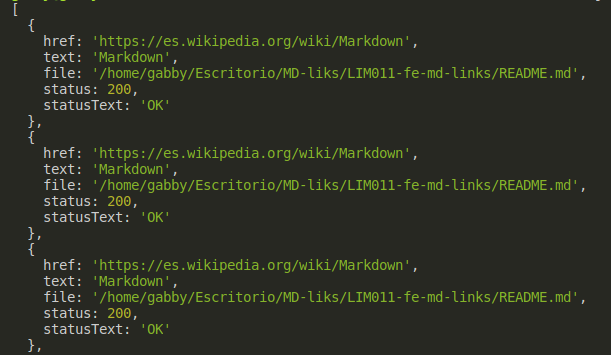

# Markdown Links

[Markdown](https://es.wikipedia.org/wiki/Markdown) es un lenguaje de marcado ligero muy popular entre developers. Es usado en muchísimas plataformas que manejan texto plano (GitHub, foros, blogs, ...), y es muy común encontrar varios archivos en ese formato en cualquier tipo de repositorio (empezando por el tradicional README.md).

Estos archivos [Markdown](https://es.wikipedia.org/wiki/Markdown) normalmente contienen *links* (vínculos/ligas) que muchas veces están rotos o ya no son válidos y eso perjudica mucho el valor de la información que se quiere compartir.

Md-links es una libreria que se desarrollo con el fin deleer y analizar archivos de formato [Markdown](https://es.wikipedia.org/wiki/Markdown) ('.md') tomando en cuenta la ruta ingresada, la ruta a ejecutar. Esta herramienta permite verificar los *links* que se encuentran dentro de los **archivos** y reportar estadísticas acerca del total de los *links*, la cantidad de *links* rotos y únicos. Esta libreria se implementó usando [Node.js](https://nodejs.org/es/).

## Diagrama de flujo

## Instalación y guia de uso de la libreria

1. **Instalación**
 
    Ejecute en la terminal la siguiente linea de comando.
    `npm install Gabby97/LIM011-fe-md-links`

2. **Guía de uso**

    Ejecutando de la siguiente manera en la terminal.
    `md-links <path-to-file>[options]`

    *Donde:*
    - path-to-file: Es la ruta absoluta o relativa al archivo o directorio que se desea analizar.
    - Options: Se tiene las siguientes opciones para ejecutar en la linea de comando: --validate, --stats,--stats y --validate juntos.

### API 
**`mdLinks(path, opts)`**
##### Argumentos

- `path`: Ruta absoluta o relativa al archivo o directorio. Si la ruta pasada es
  relativa, debe resolverse como relativa al directorio desde donde se invoca
  node - _current working directory_).
- `options`: Un objeto con las siguientes propiedades:
  * `validate`: Booleano que determina si se desea validar los links
    encontrados.

##### Valor de retorno

La función debe retornar una promesa (`Promise`) que resuelva a un arreglo
(`Array`) de objetos (`Object`), donde cada objeto representa un link y contiene
las siguientes propiedades:

- `href`: URL encontrada.
- `text`: Texto que aparecía dentro del link (`<a>`).
- `file`: Ruta del archivo donde se encontró el link.

#### Ejemplo

*Carga de módulo via require*

`const mdLinks = require("md-links");`

**Se puede usar la opción validate**

`mdLinks('/home/gabby/Escritorio/MD-liks/LIM011-fe-md-links/README.md', {validate: false}).then((ress) => {
  console.log(ress); 
});`

**El resultado sería**

**Para la validación de los lonks** 

`mdLinks('/home/gabby/Escritorio/MD-liks/LIM011-fe-md-links/README.md', {validate: true}).then((ress) => {
  console.log(ress); 
});`

### CLI (Command Line Interface - Interfaz de Línea de Comando)

El ejecutable de nuestra aplicación debe poder ejecutarse de la siguiente
manera a través de la terminal:

`md-links <path-to-file> [options]`

Por ejemplo:

El comportamiento por defecto no valida si las URLs responden ok o no, solo identifica el archivo markdown (a partir de la ruta que recibe como argumento), analiza el archivo Markdown e imprime los links que vaya encontrando, junto con la ruta del archivo donde aparece y el texto que hay dentro del link.

**Options**

**`--validate`** 

Si pasamos la opción *--validate*, el módulo hace una petición HTTP para averiguar si el link funciona o no. Si el link resulta en una redirección a una URL que responde ok, entonces considera el link como ok.

Por ejemplo:

El output en este caso incluye la palabra ok, fail o el link no existe después de la URL, así como el status de la respuesta recibida a la petición HTTP a dicha URL.

**`--stats`** 

Si pasamos la opción *stats*, el output será un texto con estadísticas Total y Unique de los links.

Por ejemplo:

También podemos combinar *--stats* y *--validate* para obtener estadísticas que necesiten de los resultados de la validación.

Por ejemplo:

## Objetivos de aprendizaje

Recuerda colocar en esta seccion los objetivos de aprendizaje que quedaron 
pendientes de tu proyecto anterior.

### Javascript
- [ ] Uso de callbacks
- [ ] Consumo de Promesas
- [ ] Creacion de Promesas
- [ ] Modulos de Js
- [ ] Recursión

### Node
- [ ] Sistema de archivos
- [ ] package.json
- [ ] crear modules
- [ ] Instalar y usar modules
- [ ] npm scripts
- [ ] CLI (Command Line Interface - Interfaz de Línea de Comando)

### Testing
- [ ] Testeo de tus funciones
- [ ] Testeo asíncrono
- [ ] Uso de librerias de Mock
- [ ] Mocks manuales
- [ ] Testeo para multiples Sistemas Operativos

### Git y Github
- [ ] Organización en Github

### Buenas prácticas de desarrollo
- [ ] Modularización
- [ ] Nomenclatura / Semántica
- [ ] Linting
